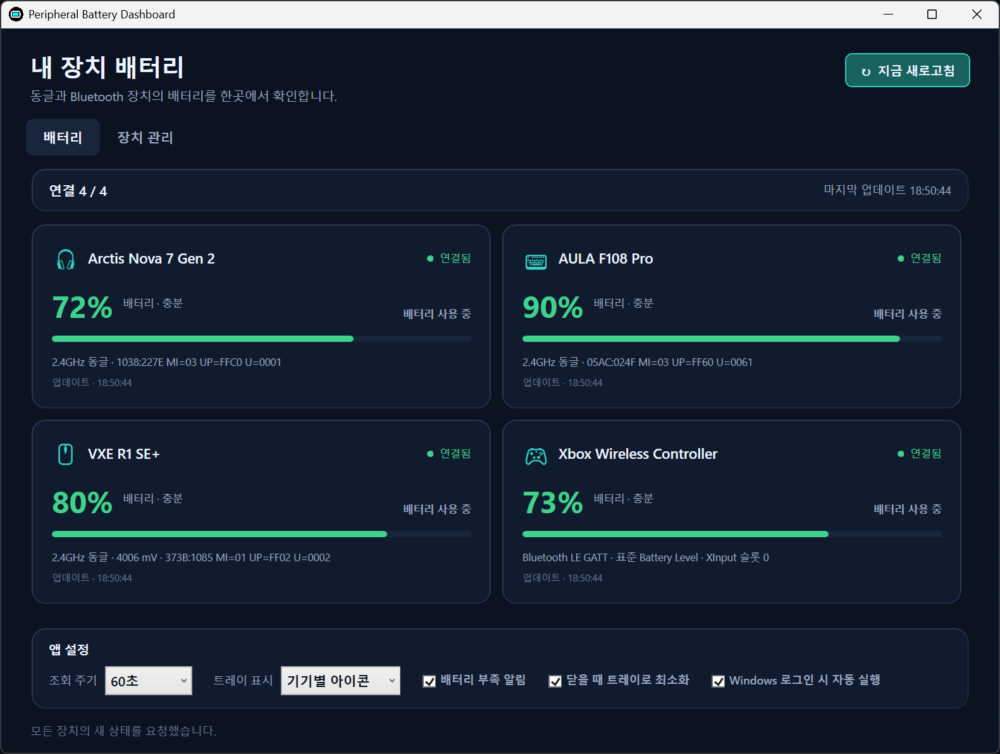

# Peripheral Battery Dashboard

Windows에서 동글 또는 Bluetooth로 연결한 주변기기의 배터리 상태를 대시보드와 트레이에서 확인하는 앱입니다. 공개 배포본에는 활성 장치 프로필이 포함되지 않으며, 로컬 코딩 에이전트가 이 PC의 실제 장치를 확인하고 검증된 지원을 사용자 프로필로 구성합니다.

> [!IMPORTANT]
> **이 프로젝트의 공식 설치 방식은 로컬 Windows에 접근할 수 있는 Codex 또는 코딩 에이전트를 통하는 것입니다. 사용자가 ZIP을 직접 내려받아 실행하거나 소스를 직접 빌드·배치하는 설치 절차는 제공하지 않습니다.**
> 아래 프롬프트를 코드 블록의 처음부터 끝까지 복사해 Codex Desktop 같은 로컬 코딩 에이전트에 전달하세요. 일반 웹 채팅처럼 로컬 파일·셸·장치에 접근할 수 없는 환경에서는 설치와 호환성 진단을 끝낼 수 없습니다.

## 문서 안내

이 README는 처음 방문한 사용자를 위한 안내서입니다. 앱의 목적, 공식 GitHub Release, 설치 요청 방법, 화면 표시, 설치 후 사용·진단·제거 흐름을 설명합니다.

- [AGENTS.md](AGENTS.md): 코딩 에이전트가 반드시 따라야 하는 안전·승인·개인정보·구현·검증·게시 규칙
- [CODEX-PROMPTS.md](CODEX-PROMPTS.md): 설치·업데이트·진단·기기 추가·제거를 위한 목적별 요청문
- [DEVICE-ADDING.md](DEVICE-ADDING.md): 새 기기의 식별, 프로토콜 조사, 공급자 구현과 검증 절차

사용자는 `AGENTS.md`나 `DEVICE-ADDING.md`의 기술 절차를 직접 수행할 필요가 없습니다.

## 공식 설치 요청 방법

설치·업데이트와 새로운 장치 지원 조정은 Codex 같은 로컬 코딩 에이전트가 저장소 문서·진단 결과·소스를 함께 검토하며 수행하는 것을 전제로 합니다. 아래 프롬프트는 설치, 읽기 전용 인벤토리, 미지원 기기 조사와 검증된 지원 등록을 한 작업으로 요청합니다. 설치가 완료된 뒤 배터리 대시보드와 트레이 기능을 평소에 사용하는 데에는 Codex가 필요하지 않습니다.

1. 설치할 Windows PC에서 로컬 셸과 파일을 사용할 수 있는 Codex 또는 코딩 에이전트를 엽니다. 저장소와 ZIP을 사용자가 먼저 받을 필요는 없습니다.
2. 아래 프롬프트 **전체**를 그대로 전달합니다. 사용하는 제품과 실제 연결 방식을 한 줄에 하나씩 모두 적을 수 있으며, 기기마다 프롬프트를 따로 보낼 필요가 없습니다. 목록을 비워도 에이전트가 설치 후 읽기 전용 HID 및 표준 Bluetooth 서비스 인벤토리로 연결된 후보를 찾습니다.
3. 에이전트가 공식 GitHub Release 확인·다운로드, 안정된 설치 위치 배치, 자체 테스트와 읽기 전용 인벤토리, 표준 Bluetooth의 범용 프로필 등록 또는 나머지 미지원 기기의 공개 자료 조사와 호환성 구현을 순서대로 수행하게 합니다. 소스 수정이나 빌드가 필요한 경우에만 같은 Release 태그의 소스를 사용합니다.
4. 에이전트가 다운로드·설치·레지스트리/자동 실행 변경·첫 GUI 실행 또는 실제 장치 요청 전에 설명하는 대상과 영향을 확인하고 승인 여부를 결정합니다.

```text
다음 저장소의 Peripheral Battery Dashboard를 이 Windows PC에 설치하고, 아래 목록과 이 PC에서 발견한 모든 배터리 주변기기의 호환성을 한 작업에서 점검·추가해 줘.

저장소: https://github.com/rpr123/PeripheralBatteryDashboard

설치에는 공식 v1.1.3 GitHub Release의
PeripheralBatteryDashboard-v1.1.3-win-x64.zip과 SHA256SUMS.txt를 사용하라.
GitHub가 자동 생성한 Source code 압축 파일, 기본 브랜치, Actions artifact,
저장소 트리의 ZIP 또는 제3자 미러를 공식 설치 패키지와 섞지 마라.
소스 수정이나 빌드가 필요한 경우에만 공식 저장소에서 같은 v1.1.3 태그의 소스를 사용하라.

공식 Release 압축본의 README.md에서 공식 배포 경로와 사용자에게 약속된 동작을 확인하라.
AGENTS.md의 강제 안전·승인·개인정보·구현·검증·게시 규칙은 반드시 따라라.
새 기기 조사·구현에는 DEVICE-ADDING.md의 절차를 적용하고,
CODEX-PROMPTS.md는 목적별 후속 요청문의 참고로 사용하라.

문서가 충돌하면 각 문서가 소유한 영역을 따르되,
안전·승인·개인정보·검증·게시 경계에서는 AGENTS.md를 우선하라.

공개 배포본의 활성 기본 기기 프로필은 0개다.
목록이 비어 있어도 승인된 읽기 전용 인벤토리와 최소 질문 절차로 후보를 식별하고,
한 기기의 실패 때문에 나머지 기기의 작업을 생략하지 마라.

설치에서 끝내지 마라. 기존 프로토콜이 없거나 사용자가 자료를 주지 않았다는 이유로 즉시 중단하지 말고, 외부로 보낼 비식별화 정보와 조사 범위를 설명해 승인받은 뒤 문서에 정한 공개 근거 조사를 직접 수행하라. 근거가 충분한 경우에만 기존 공급자를 재사용하거나 새 공급자·검증 데이터·사용자 프로필을 구현하고, 조사 후에도 안전한 읽기 전용 근거가 부족하면 해당 기기만 `지원 보류(blocked)`로 남겨 확인한 내용과 이유를 보고하라.

현재 에이전트가 신규 프로토콜 조사·구현에 필요한 역량을 갖추지 못했다면 안전한 인벤토리와 조사 기록을 보존해 더 적합한 에이전트에 인계하고, 불완전한 지원을 설치하거나 완료를 주장하지 마라. 입증되지 않은 HID 명령을 추측해 보내거나 퍼징하지 마라.

다운로드, 파일 쓰기와 배치, 첫 GUI 실행, 자동 실행·레지스트리 변경, 외부 전송·검색, 실제 장치 I/O는 대상과 영향을 먼저 설명하고 문서에 따라 필요한 승인을 받아라.

완료 후 설치 위치와 버전, 공식 Release ZIP을 그대로 설치했는지 같은 태그의 소스를 수정·빌드한 파생 설치본인지, 무결성·테스트 결과, 자동 실행 상태, 각 기기의 지원 상태와 근거, 실행·제거 방법을 보고하라.

사용 제품 및 연결 방식(여러 개 입력 가능, 전부 비워도 됨):
- [제품명/리비전] — [Bluetooth / 2.4GHz USB 동글 / 유선]
- [제품명/리비전] — [Bluetooth / 2.4GHz USB 동글 / 유선]
- ...
```

설치·업데이트·진단·미지원 기기 추가·제거를 따로 요청하려면 사용자가 명령을 직접 실행하지 말고 [CODEX-PROMPTS.md](CODEX-PROMPTS.md)의 목적별 프롬프트를 로컬 에이전트에 전달하세요.

### 에이전트 모델 선택

표준 Bluetooth Battery Service 등록, 이미 검증된 공급자와 동일한 프로토콜의 JSON 프로필 작성, 설치·업데이트·인벤토리 같은 정형 작업은 로컬 도구를 사용할 수 있는 경량 모델도 수행할 수 있습니다.

반면 프로토콜이 알려지지 않은 USB 동글/HID 기기의 식별, 제조사 자료·공개 소스 분석, 요청·응답 형식 추출, 새 공급자 구현과 독립 검토에는 고수준 추론 에이전트가 필요할 수 있습니다. Luna급 모델을 이 작업의 단독 구현자나 단독 검토자로 사용하지 마세요.

현재 OpenAI 모델군을 기준으로 복잡한 신규 동글 작업에는 GPT-5.6 Sol의 `high` 또는 `xhigh` 추론 수준을 기본 권고하며, 근거가 불명확하거나 서로 충돌하면 `max`도 검토할 수 있습니다. 자세한 모델 구분은 [공식 OpenAI 모델 가이드](https://developers.openai.com/api/docs/guides/latest-model)를 참고하세요.

장치별 공개 근거와 프로토콜 난도가 다르므로 성공을 보장하는 정확한 최소 모델이나 추론 수준을 일률적으로 정할 수는 없습니다. 모델의 역량이 부족하면 조사 기록을 보존해 더 적합한 모델에 인계해야 하며, 모델 이름만으로 지원 완료를 판단하지 않습니다.

## 화면 예시

대시보드에서는 연결된 장치의 배터리 잔량과 연결 방식, 현재 조회 상태와 마지막 조회 시각을 한 화면에서 확인할 수 있습니다. 최근 성공값을 표시하는 경우에는 마지막 성공 측정으로부터 지난 시간도 별도로 표시합니다. 아래 화면은 에이전트가 한 PC의 사용자 프로필을 구성한 뒤의 카드 배치 예시이며, 최신 상태 문구와 색상은 아래 표시 기준을 따릅니다. 해당 네 기기가 배포판에 기본 등록된다는 뜻은 아니며, 배터리 수치는 촬영 당시의 예시입니다.



기기별 트레이 표시를 선택하면 작업표시줄 우하단에서 헤드셋·키보드·마우스·게임패드 실루엣과 배터리 숫자를 각각 확인할 수 있습니다.


### 표시 기준

색상은 잔량, 흐림은 값의 신선도, 작은 경고는 현재 조회 결과를 나타냅니다.

| 표시 | 의미 |
|---|---|
| 빨강 숫자·막대 | 0–10% 또는 단계형 최저 |
| 주황 숫자·막대 | 11%–기기별 부족 기준(기본 20%) 또는 단계형 낮음 |
| 초록·청록 숫자·막대 | 부족 기준 초과 또는 단계형 보통 이상 |
| 흐린 숫자·막대 | 24시간 이내의 마지막 성공값이며 당시 잔량 색 유지 |
| 회색 윤곽·`—` | 성공값이 없거나 마지막 성공 후 24시간 초과 |
| `?`(트레이) | 정확한 퍼센트 없이 단계만 확인됐거나 첫 조회 중 |
|  작은 주황 경고 | 현재 값을 새로 확인하지 못함 |
| `⚡`(트레이) | 현재 확인된 충전 중 상태 |

조회 실패만으로 카드나 트레이 윤곽·배경이 잔량 경고색으로 바뀌지 않습니다. 저장된 성공값이 없거나 24시간을 넘으면 회색 윤곽과 `—`를 사용하고 현재 조회 문제는 작은 주황 경고로만 구분합니다. 24시간이 지난 마지막 값과 성공 시각은 상세 정보에만 남습니다.

## 공식 배포와 무결성

공식 배포 패키지는 이 저장소의 **GitHub Release 자산**으로만 제공합니다.

저장소 트리의 ZIP, GitHub Actions artifact, 제3자 미러와 GitHub가 자동 생성하는 `Source code (zip)`·`Source code (tar.gz)`는 공식 설치 패키지가 아닙니다. 아래 링크는 설치 에이전트가 출처와 무결성을 확인하기 위한 것이며, 사용자 수동 설치 절차가 아닙니다.

- 공식 Release: [Peripheral Battery Dashboard v1.1.3](https://github.com/rpr123/PeripheralBatteryDashboard/releases/tag/v1.1.3)
- Windows x64 패키지: [PeripheralBatteryDashboard-v1.1.3-win-x64.zip](https://github.com/rpr123/PeripheralBatteryDashboard/releases/download/v1.1.3/PeripheralBatteryDashboard-v1.1.3-win-x64.zip)
- SHA-256 목록: [SHA256SUMS.txt](https://github.com/rpr123/PeripheralBatteryDashboard/releases/download/v1.1.3/SHA256SUMS.txt)

에이전트는 같은 `v1.1.3` Release에서 ZIP과 `SHA256SUMS.txt`를 함께 받은 뒤, 압축 해제나 실행 전에 해시를 계산해 목록의 해당 항목과 비교합니다.

```powershell
Get-FileHash .\PeripheralBatteryDashboard-v1.1.3-win-x64.zip -Algorithm SHA256
```

현재 배포 바이너리는 Authenticode 코드 서명이 되어 있지 않습니다. Windows SmartScreen 또는 백신이 **알 수 없는 게시자** 경고를 표시할 수 있습니다. 에이전트는 경고를 자동으로 우회하지 않고, 공식 출처와 SHA-256 확인 결과를 사용자에게 보여 준 뒤 실행 여부를 별도로 확인합니다.

소스 수정이나 빌드가 필요한 경우에는 공식 Release와 같은 태그의 소스만 사용합니다. 로컬에서 만든 출력은 공식 GitHub Release 자산이 아니라 해당 태그를 기반으로 한 파생 설치본이며, 에이전트가 이를 최종 보고에서 구분합니다.

요구 환경은 **Windows 10/11 x64와 .NET Framework 4.8**입니다. 새 설치의 활성 장치 프로필은 0개입니다. 따라서 설치 에이전트가 사용자 PC에서 장치를 조사·등록하기 전 빈 대시보드가 보이는 것이 정상입니다.

## 검증된 공급자 구현(자동 지원 목록 아님)

아래 공급자 구현은 코드에 포함되어 있지만 공개 배포본이 해당 장치를 자동 등록하는 것은 아닙니다. 같은 제품명이어도 하드웨어 리비전과 연결 방식이 다를 수 있으므로, 에이전트가 현재 PC의 장치와 프로토콜 동일성을 확인한 뒤 사용자 프로필에서 재사용합니다.

| 장치 또는 규격 | 연결 | 표시 가능한 값 |
|---|---|---|
| SteelSeries Arctis Nova 7 Gen 2 | 2.4GHz USB 동글 | 잔량 백분율, 충전 상태 |
| AULA F108 Pro | 2.4GHz USB 동글 | 잔량 백분율 |
| VXE R1 SE+ | 2.4GHz USB 동글 | 잔량 백분율, 충전 상태, 전압 |
| Bluetooth SIG 표준 Battery Service 기기 | Bluetooth LE | 잔량 백분율 |
| Xbox Wireless Controller | Bluetooth 또는 별도로 검증된 연결 경로 | 잔량 백분율 또는 4단계 잔량 |

Windows에 Bluetooth SIG 표준 Battery Service를 노출하는 키보드·마우스·펜·게임패드 등은 브랜드별 공급자를 새로 만들지 않고 범용 공급자로 등록할 수 있습니다.

표준 Battery Service가 없는 Bluetooth 기기도 지원 대상에서 곧바로 제외되는 것은 아닙니다. 에이전트가 해당 기기의 제조사 전용 읽기 프로토콜을 공개 근거에서 조사하고 안전하게 검증할 수 있으면 별도 공급자와 사용자 프로필로 등록할 수 있습니다.

이 표는 같은 제품명의 모든 장치를 자동 지원한다는 뜻이 아닙니다. 하드웨어 리비전과 연결 방식, 정확한 식별 조건과 프로토콜이 다르면 설치 과정에서 별도 조사가 필요합니다.

[`Profiles/builtin.devices.json`](Profiles/builtin.devices.json)은 의도적으로 비어 있습니다. 지원 여부는 제품명만으로 결정하지 않고, 설치하는 PC의 실제 장치와 연결 방식을 기준으로 확인합니다.

## 설치 후 사용

에이전트는 설치가 끝나면 안정된 설치 위치, 자체 테스트 결과, 자동 실행 상태, 실행 방법과 제거 방법을 최종 보고해야 합니다. 설치 후 평소 사용에는 에이전트가 필요하지 않습니다.

앱은 등록된 프로필 자체가 아니라 현재 PC에서 실제로 감지된 장치만 배터리 카드와 기기별 트레이 아이콘으로 표시합니다. 정확한 HID 동글이 꽂혀 있으면 주변기기 본체가 절전 중이어도 표시를 유지하고, 동글이 빠지면 숨깁니다. Bluetooth/XInput 프로필은 현재 연결된 동안 표시됩니다. 감지된 등록 장치가 하나도 없어도 앱을 열고 종료할 수 있도록 중립적인 공용 트레이 아이콘 하나는 남습니다.

1. 전원이 꺼지거나 절전 중인 장치는 버튼을 누르거나 움직여 깨운 뒤 앱에서 **새로고침**을 누릅니다.
2. 창을 닫으면 기본 설정에서는 트레이로 최소화됩니다. 완전히 종료하려면 트레이 메뉴의 **종료**를 사용합니다.
3. 트레이에 숨겨진 상태에서 에이전트가 안내한 앱 바로가기 또는 실행 파일을 열면 기존 창이 앞으로 나타납니다. 중복 모니터 프로세스는 만들지 않습니다.

기본 설정에서는 현재 Windows 사용자가 로그인할 때 앱이 창 없이 트레이에서 자동 실행됩니다. 자동 실행됐다는 별도 알림은 표시하지 않으며, 실제 배터리 부족 알림만 기존 설정에 따라 표시합니다. GUI의 **Windows 로그인 시 자동 실행** 체크박스로 언제든 켜거나 끌 수 있고 관리자 권한은 필요하지 않습니다.

설치 후 앱 폴더를 사용자가 직접 옮기거나 일부 파일만 삭제하지 마세요. 위치 변경이나 업데이트가 필요하면 이 저장소 URL과 [CODEX-PROMPTS.md](CODEX-PROMPTS.md)의 설치 프롬프트를 다시 에이전트에 전달해 자동 실행 경로와 파일 구성을 함께 조정하게 하세요.

트레이 표시의 기본값은 **기기별 아이콘**입니다. 헤드셋·키보드·마우스·게임패드는 각각 다른 기기 실루엣으로 구분하고, 실루엣 안에 배터리 숫자와 위험도 색상을 표시하며 현재 확인된 충전 중 상태는 별도의 번개로 구분합니다. 마우스를 올리면 장치 이름·표시 가능한 잔량(퍼센트 또는 단계)·충전 또는 연결 상태를 확인할 수 있고, 왼쪽 클릭하면 대시보드가 열립니다. 설정에서 **통합 아이콘**으로 즉시 전환하면 특정 장치로 오해하지 않도록 별도의 공용 모양을 사용합니다. 이 표시는 기존 조회 결과를 재사용하므로 USB/Bluetooth 조회 횟수는 늘어나지 않습니다.

Windows 11은 새 트레이 아이콘을 숨겨진 아이콘 영역으로 접을 수 있습니다. 앱에서는 아이콘을 강제로 항상 표시할 수 없으므로, 필요한 경우 Windows의 **설정 → 개인 설정 → 작업 표시줄 → 기타 시스템 트레이 아이콘**에서 각 아이콘을 켜세요. 앱 폴더 경로가 바뀌면 Windows가 새 아이콘으로 인식할 수 있어 업데이트 후 이 설정을 다시 켜야 할 수도 있습니다.

## 제거

제거도 [CODEX-PROMPTS.md](CODEX-PROMPTS.md)의 **설치본 제거** 프롬프트를 로컬 코딩 에이전트에 전달해 진행하세요. 에이전트는 실행 중인 앱, 실제 설치 폴더, 자동 실행 등록, 사용자 설정과 장치 프로필의 보존·삭제 선택을 먼저 설명하고 승인받은 범위만 제거해야 합니다.

## 조회 주기와 시스템 부담

기본 조회 주기는 30초이며 설정에서 15, 30, 60, 120초를 선택할 수 있습니다. HID 존재 확인과 등록된 공급자의 상태 요청은 설정 주기에 따라 수행되며, 응답하지 않는 공급자의 실제 요청은 최대 5분까지 백오프합니다. CPU·I/O와 장치 절전 영향은 장치 수, 드라이버와 공급자 동작에 따라 달라집니다.

응답하지 않는 기기의 조회는 제한 시간 후 중단되며 다른 기기 조회는 계속됩니다. 이 기능이 적용된 앱에서 직접 확인한 성공값부터 사용자 데이터에 저장되어 재부팅 후에도 복원됩니다. 현재 장치가 감지됐지만 새 조회가 실패하면 최근 성공값은 24시간까지 당시 위험도 색을 유지한 채 흐리게 표시되고, 현재 조회 실패는 별도의 작은 주황 경고와 사실 기반 문구로 구분됩니다.

한 번 응답하지 않았다는 이유로 기기가 영구 제외되지는 않습니다. 백오프가 끝난 뒤 다음 자동 주기나 **지금 새로고침**에서 다시 시도합니다.

앱이 실행되는 동안 표준 Bluetooth Battery Service의 동일 서비스 경로에 대한 실제 장치 갱신 시도는 5분에 한 번 이하로 제한하며, 그 사이에는 Windows 캐시를 읽습니다. 따라서 15초 화면 갱신이 곧 15초마다의 실제 Bluetooth 장치 갱신을 뜻하지는 않습니다.

30초 또는 60초는 앱의 조회 빈도를 줄이고, 15초는 화면 상태를 더 자주 갱신합니다.

## 진단과 지원 요청

문제가 생기면 사용자가 명령을 직접 실행하기보다 [CODEX-PROMPTS.md](CODEX-PROMPTS.md)의 **변경 없이 진단만** 프롬프트를 에이전트에 전달하세요.

앱 자체 검사와 읽기 전용 인벤토리는 실제 배터리 상태 요청을 보내지 않습니다. 배터리 스냅샷과 공급자 진단은 등록된 장치에 검증된 상태 요청을 보낼 수 있으므로, 에이전트가 대상과 영향을 설명하고 별도 승인을 받아야 합니다.

GUI의 장치 관리 화면에서도 진단 정보를 파일로 내보낼 수 있습니다. 문의할 때는 이 파일을 사용하고, 장치 경로·시리얼·Bluetooth 주소 같은 원본 식별 정보를 별도로 공유하지 마세요.

## 설정과 사용자 데이터

사용자 설정과 가져온 프로필은 다음 위치에 저장됩니다.

```text
%LOCALAPPDATA%\PeripheralBatteryDashboard\settings.json
%LOCALAPPDATA%\PeripheralBatteryDashboard\battery-history.json
%LOCALAPPDATA%\PeripheralBatteryDashboard\Profiles\devices.user.json
```

`battery-history.json`에는 앱이 직접 확인한 마지막 성공 잔량과 시각, 프로필 ID와 장치 선택 조건의 비식별 해시만 저장됩니다. 장치 경로·시리얼·Bluetooth 주소는 저장하지 않으며, 현재 장치가 감지되지 않으면 기록이 남아 있어도 카드와 기기별 트레이 아이콘은 숨깁니다.

자동 실행은 현재 사용자의 `HKCU\Software\Microsoft\Windows\CurrentVersion\Run`에 등록됩니다. 설치 위치 변경이나 업데이트는 에이전트가 이 등록값과 앱 폴더를 함께 확인하며 수행하게 하세요.

앱 폴더의 `Profiles\builtin.devices.json`은 배포 형식을 유지하기 위한 빈 프로필 문서이며 활성 기기를 포함하지 않습니다. 에이전트는 이 파일에 개인 장치를 추가하지 않고, 직접 조사·검증한 모든 장치를 위 사용자 프로필 폴더의 JSON에 등록해야 합니다. 프로필과 플러그인은 시작할 때 읽으므로 변경 후 앱을 완전히 종료했다가 다시 실행해야 합니다.

장치 교체와 추가에는 [CODEX-PROMPTS.md](CODEX-PROMPTS.md)의 목적별 프롬프트를 사용하세요. [DEVICE-ADDING.md](DEVICE-ADDING.md)는 사용자가 직접 따라 하는 설치 절차가 아니라 에이전트가 읽는 조사·구현 문서입니다.

## 문제 발생 시

설치·업데이트·호환성 문제는 직접 드라이버나 설치 파일을 바꾸기보다 [CODEX-PROMPTS.md](CODEX-PROMPTS.md)의 진단 프롬프트를 에이전트에 전달하세요.

- **동글 연결 안 됨:** 동글을 다시 꽂고 장치의 전원을 켠 뒤 새로고침합니다. USB 허브 대신 본체 포트도 시험해 보세요.
- **최근 응답 없음:** 장치를 사용해 깨운 뒤 다시 조회합니다. 실제 절전 상태인지는 프로토콜이 명시적으로 알려 주는 경우에만 구분됩니다.
- **장치에 접근할 수 없음:** 제조사 설정 프로그램이 같은 인터페이스를 사용 중일 가능성 등은 진단 결과에서 확인합니다.
- **Bluetooth 또는 Xbox 연결 안 됨:** 장치 전원과 Windows 페어링 상태를 확인한 뒤 진단 프롬프트를 전달합니다.
- **지원 모듈 또는 플러그인 오류:** 진단 프롬프트를 에이전트에 전달합니다. 출처가 확인되지 않은 DLL을 직접 설치하거나 차단 해제하지 마세요.
- **목록에 없는 기기:** 기기 추가 프롬프트를 전달합니다. 기존 공급자가 없다는 이유만으로 지원 불가가 확정되는 것은 아닙니다.

## 라이선스

앱 소스와 저장소 문서는 [MIT License](LICENSE)로 배포됩니다. 프로토콜 조사에 참고한 외부 자료와 별도 저작권 고지는 [THIRD-PARTY-NOTICES.md](THIRD-PARTY-NOTICES.md)를 확인하세요.
